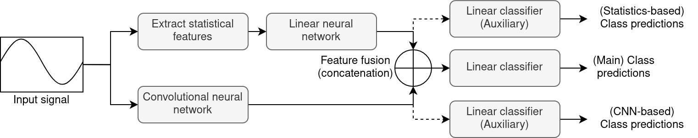

Lightning-Fast Modulation Classification with Hardware-Efficient Neural Networks
=
***This repo contains our submission for the AI for Good Machine Learning in 5G Challenge<sup>1</sup>, specifically the ITU-ML5G-PS-007 task.***

## Authors
<b>Team Name:</b> Imperial_IPC1

<b>Supervising faculty member</b>: Prof. Deniz Gunduz, Imperial College London, Email: d.gunduz@imperial.ac.uk

<b>Team members</b>:
* Dr. Anouar Yatribi (PostDoc Team Leader), Imperial College London, Email: a.yatribi@imperial.ac.uk
* Mr. Waleed El-Geresy, Imperial College London, Email: waleed.el-geresy15@imperial.ac.uk
* Mr. Mikolaj Jankowski, Imperial College London, Email: mikolaj.jankowski17@imperial.ac.uk
* Ms. Wing Lo, Imperial College London, Email: wing.lo18@imperial.ac.uk

## Dataset
In this work we learn to classify modulation schemes through training a model on the DeepSig RadioML 2018 dataset<sup>2, 3</sup>. The dataset contains synthetic simulated channel effects and over-the-air recordings of 24 digital and analog modulation types and has been heavily validated. The data are
stored in hdf5 format, and contain more than 2 million examples of received signals.

## Method
The architecture of our proposed solution is shown in the figure below:



Dotted lines indicate parts of the architecture that are present during training, to improve convergence, but removed at the inference stage. Namely, the Auxiliary Classifier branches.

The main stages of the architectural pipeline are as follows:
- Data Pre-processing
- Auxiliary Classifier Branches
- Model Pruning
- Post-Training Quantization Level Reduction

We now describe each of these steps in detail.

### Data Pre-processing

To extract more in-depth statistical information about the image (including higher-order cumulants<sup>4</sup>, moments and instantaneous
amplitude, phase, and frequency), we introduce a number of computationally inexpensive 
pre-processing operations. This disentangled information makes it easier for the network to learn.

The resulting features are then fed to a simple linear neural network. The other branch of the network
applies learnable transforms to the input signal directly by processing it through a sequence of convolutional layers.
The resulting vectors are then concatenated and fed into a final classification layer, which operates on the concatenated, processed feature vector.

### Auxiliary Classifier Branches

In order to increase the initial accuracy, and achieve a better starting point for network pruning, we introduce two
auxiliary classifiers, which consider the inputs from each of the branches (linear and convolutional branches, respectively) separately. At training time, we calculate
cross-entropy loss between the true labels and the predictions output by each of the classifiers individually, and sum them to obtain a combined loss.

Utilising the auxiliary classifiers enables the classifiers to converge more quickly, and output more meaningful features.
In the final architecture, we remove the auxiliary classifiers to reduce the computational complexity. These classifiers can be thought of as the "bike training wheels" of our network.

### Model Pruning

After performing the initial training, we prune the neural network to save further computational and memory resources.
We apply simple unstructured L1-norm-based pruning, where in each pruning step 15% of the weights with the smallest
absolute values are removed from the network.
After each pruning step, we perform 20 epochs of fine-tuning to regain accuracy. To further increase the performance, we utilize cross-entropy loss and knowledge distillation loss, where we consider the original (unpruned) model as a teacher, and the pruned network as a student.

### Quantisation Level Reduction

Finally, we apply quantisation level reduction to the trained models, reducing the model bit widths from the initial 6 bits, to between 5 and 4 bits. This reduces the resource requirements, while maintaining a good level of accuracy.

## Results

The results achieved by our network (at different quantization levels) are presented in the table below:

| Model                                        | Accuracy | Bit operations | Bit memory | Final score (w. r. t. baseline) |
|----------------------------------------------|----------|----------------|------------|---------------------------------|
| Baseline                                     | 59.47%   | 807699904      | 1244936    | 1.0                             |
| Ours (8 bits + pruning)                      | 60.42%   | 79588160       | 819328     | 0.378                           |
| Ours (6 bits + pruning)                      | 58.34%   | 30614424       | 312204     | 0.144                           |
| Ours (6 bits + pruning + lowered bit levels) | 56.4%    | 21084790       | 242983     | 0.1106                          |

All of our models achieve accuracy above the threshold defined by the challenge organizers, and several
require an order of magnitude lower amount of computational and memory resources.

## Replicating the Results

In order to replicate our results, please follow these steps:

1. Clone this repo and install all the required packages (alternatively you can use Docker by running ```./run_docker_gpu.sh``` or ```./run_docker_no_gpu.sh```).
2. Download the DeepSig RadioML 2018 dataset and change the path to your local copy of the data in the following files
(or create data/ folder and copy GOLD_XYZ_OSC.0001_1024.hdf5 into this directory):
    * train_initial.py,
    * prune.py,
    * evaluate.py.
4. Run ```python train_initial.py``` to perform the initial training of the neural network.
5. Once finished, run ```python prune.py``` to perform consecutive pruning and fine-tuning steps of the network generated in the previous step.
6. In order to evaluate the network, export it to the ONNX format, and estimate the number of bit operations and bit memory required,
run ```python export_onnx.py```, ```python export_inference_cost.py```, and ```python evaluate.py```, in the same order.

Other files in this repo are as follows:
* models.py - contains the definitions of the models used in the training and evaluation phases,
* dataloader.py - contains the radioml_18_dataset, which provides functionalities for the PyTorch Dataloader. This file
is a copy of the dataset file that can be found in the official baseline implementation<sup>5</sup> provided by the competition organizers.
* models/initial_model.pth - pretrained initial model,
* models/final_model.pth - model pruned for 9 pruning iterations,
* models/model_export.onnx - ONNX model output by export_onnx.py,
* models/model_final.onnx - ONNX model processed by the finn library<sup>6</sup>,
* models/model_cost.json - inference cost report output by the finn library.

## Questions?

If you have any further questions related to this repo, feel free to contact mikolaj.jankowski17@imperial.ac.uk or raise an issue within this repo. I'll do my best to reply as soon as possible.
   
## References

1. Challenge website: https://challenge.aiforgood.itu.int/
2. DeepSig RadioML 2018 dataset: https://www.deepsig.ai/datasets
3. T. J. O’Shea, T. Roy and T. C. Clancy, "Over-the-Air Deep Learning Based Radio Signal Classification," in IEEE Journal of Selected Topics in Signal Processing.
4. A. Abdelmutalab, K. Assaleh, M. El-Tarhuni, "Automatic modulation classification based on high order cumulants and hierarchical polynomial classifiers," in Physical Communication.
5. https://github.com/Xilinx/brevitas-radioml-challenge-21
6. https://github.com/Xilinx/finn
